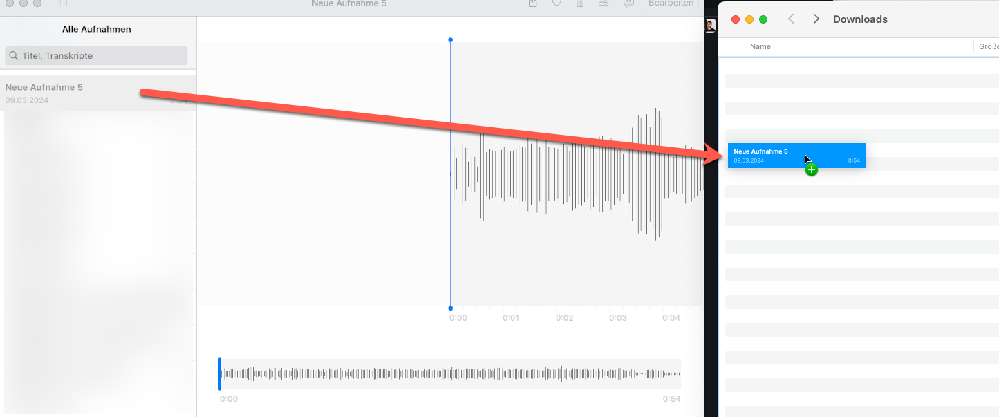
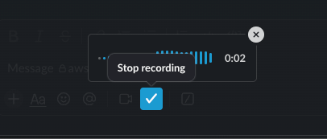

# CLI Requirements summary from voice memo with AWS CLI and ffmpeg

## Install before

- ffmpeg
- aws cli

## Credentials

Assume an aws account on cli

## Configure

- Have a bucket configured in `config.json`
- Have the model referenced in llm/bedrock.go allowed (like  "anthropic.claude-3-5-sonnet-20240620-v1:0")

## Run

1) Prepare prompt.txt, copy one from the prompt-example.txt or use your own
2) Record voice memo on mac or record to slack and download mp4 file
3) Drag and drop it into the working directory
 - Remember file name
4) `go run main.go filename`
5) See `result.txt`


# Example usage:

```
go run main.go br.m4a
```

## ffmpeg

```
ffmpeg version 7.1.1 Copyright (c) 2000-2025 the FFmpeg developers
  built with Apple clang version 16.0.0 (clang-1600.0.26.6)
  configuration: --prefix=/opt/homebrew/Cellar/ffmpeg/7.1.1_2 --enable-shared --enable-pthreads --enable-version3 --cc=clang --host-cflags= --host-ldflags='-Wl,-ld_classic' --enable-ffplay --enable-gnutls --enable-gpl --enable-libaom --enable-libaribb24 --enable-libbluray --enable-libdav1d --enable-libharfbuzz --enable-libjxl --enable-libmp3lame --enable-libopus --enable-librav1e --enable-librist --enable-librubberband --enable-libsnappy --enable-libsrt --enable-libssh --enable-libsvtav1 --enable-libtesseract --enable-libtheora --enable-libvidstab --enable-libvmaf --enable-libvorbis --enable-libvpx --enable-libwebp --enable-libx264 --enable-libx265 --enable-libxml2 --enable-libxvid --enable-lzma --enable-libfontconfig --enable-libfreetype --enable-frei0r --enable-libass --enable-libopencore-amrnb --enable-libopencore-amrwb --enable-libopenjpeg --enable-libspeex --enable-libsoxr --enable-libzmq --enable-libzimg --disable-libjack --disable-indev=jack --enable-videotoolbox --enable-audiotoolbox --enable-neon
  libavutil      59. 39.100 / 59. 39.100
  libavcodec     61. 19.101 / 61. 19.101
  libavformat    61.  7.100 / 61.  7.100
  libavdevice    61.  3.100 / 61.  3.100
  libavfilter    10.  4.100 / 10.  4.100
  libswscale      8.  3.100 /  8.  3.100
  libswresample   5.  3.100 /  5.  3.100
  libpostproc    58.  3.100 / 58.  3.100
Input #0, mov,mp4,m4a,3gp,3g2,mj2, from 'br.m4a':
  Metadata:
    major_brand     : M4A
    minor_version   : 0
    compatible_brands: M4A isommp42
    creation_time   : 2025-06-04T14:08:45.000000Z
    voice-memo-uuid : 5F37C353-3916-45E3-A20D-438478A6D8A3
    encoder         : com.apple.VoiceMemos (iPad Version 15.5 (Build 24F74))
  Duration: 00:03:19.55, start: 0.000000, bitrate: 113 kb/s
  Stream #0:0[0x1](und): Audio: aac (LC) (mp4a / 0x6134706D), 48000 Hz, stereo, fltp, 109 kb/s (default)
      Metadata:
        creation_time   : 2025-06-04T14:08:45.000000Z
        handler_name    : Core Media Audio
        vendor_id       : [0][0][0][0]
File 'br.mp3' already exists. Overwrite? [y/N] Not overwriting - exiting
```

## Copy S3

```
Copying br.mp3 to s3://myawsbucket/summary/br.mp3...
upload: ./br.mp3 to s3://myawsbucket/summary/br.mp3
```

## Transscript Job

```
Starting transcription job 'br-DMIN-1749053548' for s3://myawsbucket/summary/br.mp3...
{
    "TranscriptionJob": {
        "TranscriptionJobName": "br-DMIN-1749053548",
        "TranscriptionJobStatus": "IN_PROGRESS",
        "LanguageCode": "en-US",
        "MediaSampleRateHertz": 48000,
        "MediaFormat": "mp3",
        "Media": {
            "MediaFileUri": "s3://myawsbucket/summary/br.mp3"
        },
        "StartTime": "2025-06-04T18:12:30.139000+02:00",
        "CreationTime": "2025-06-04T18:12:30.120000+02:00"
    }
}
Waiting for transcription job 'br-DMIN-1749053548' to complete...
Current status: IN_PROGRESS
```

## Get Text

```
download: s3://myawsbucket/summary/output/br-DMIN-1749053548.json to summary/output/br-DMIN-1749053548.json
```

## Use Model

```
Calling Bedrock model 'anthropic.claude-3-5-sonnet-20240620-v1:0'...
Done. Result written to result.txt
```

## Getting Voice VoiceMemo

### Use VoiceMemo from Mac, Iphone....


- Record & Drag and Drop in this directory



### Use VoiceMemo from Slack....

- Record it


- Download it

